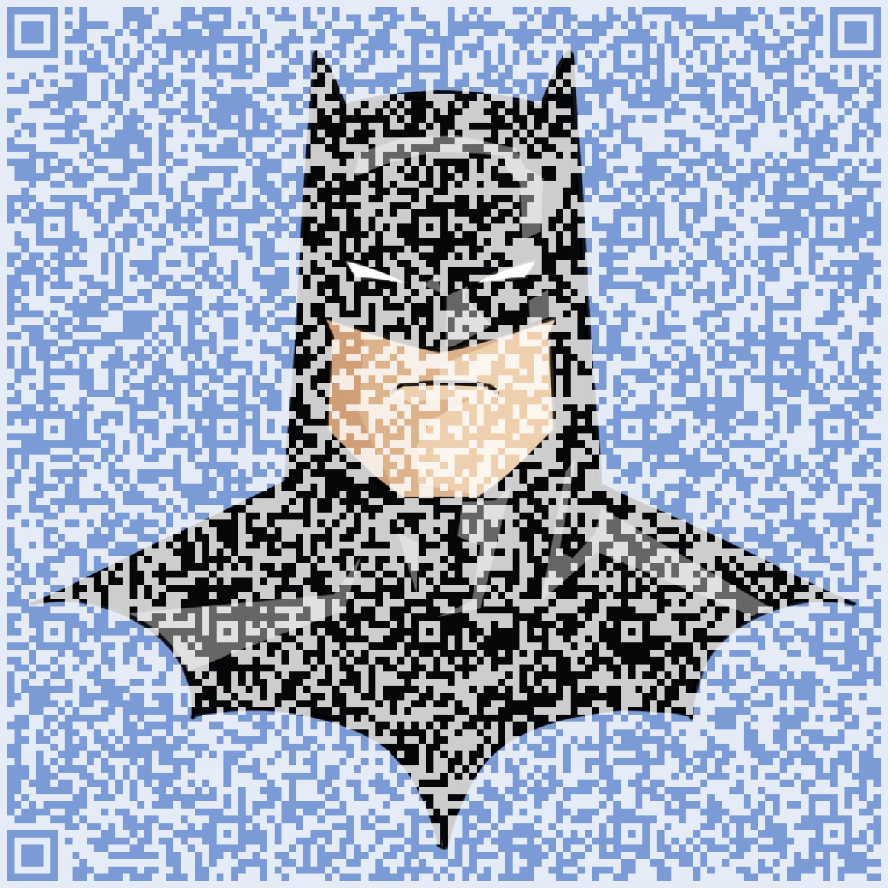
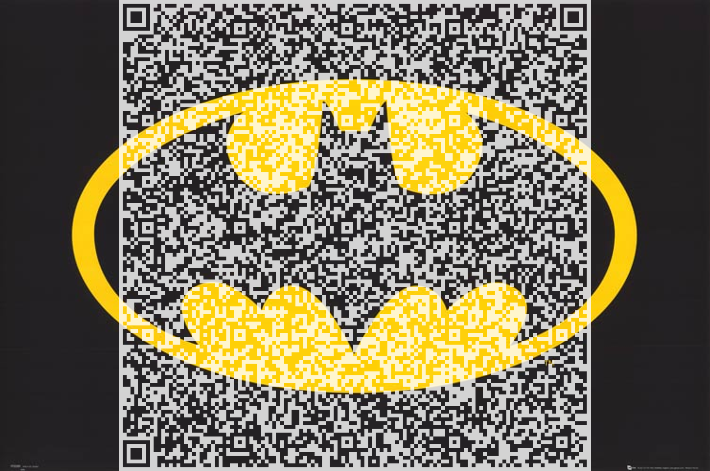
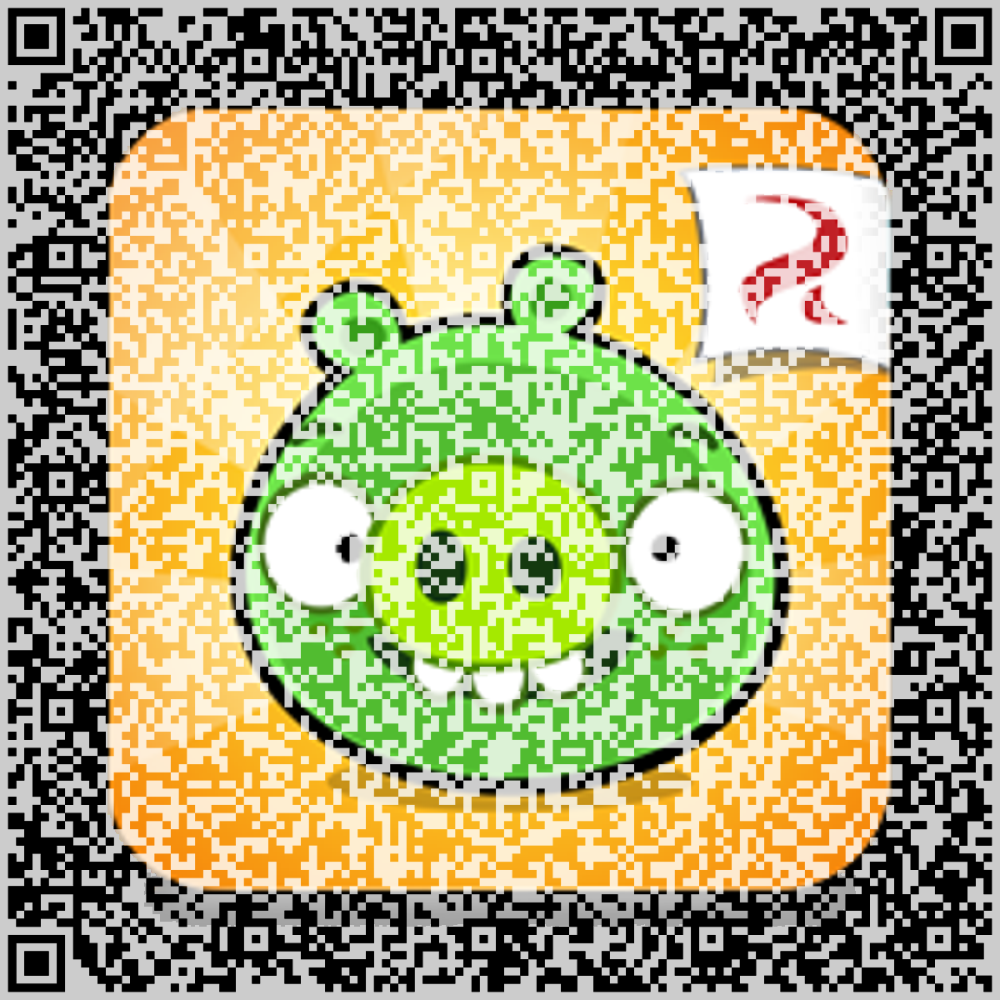
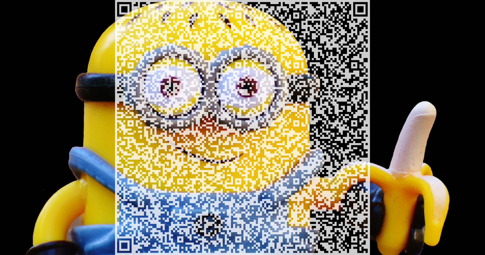
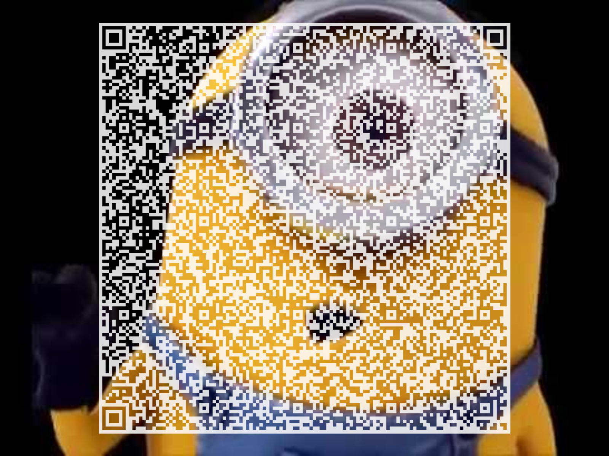
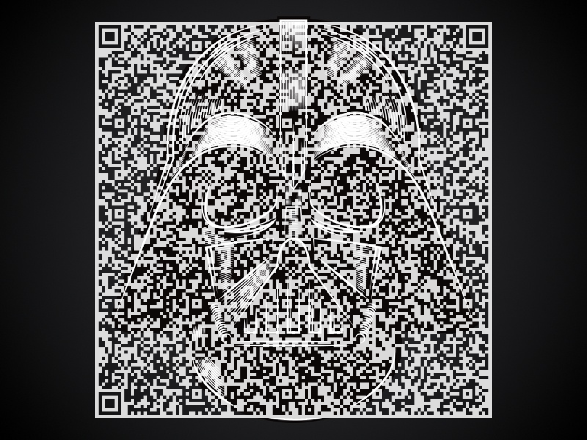
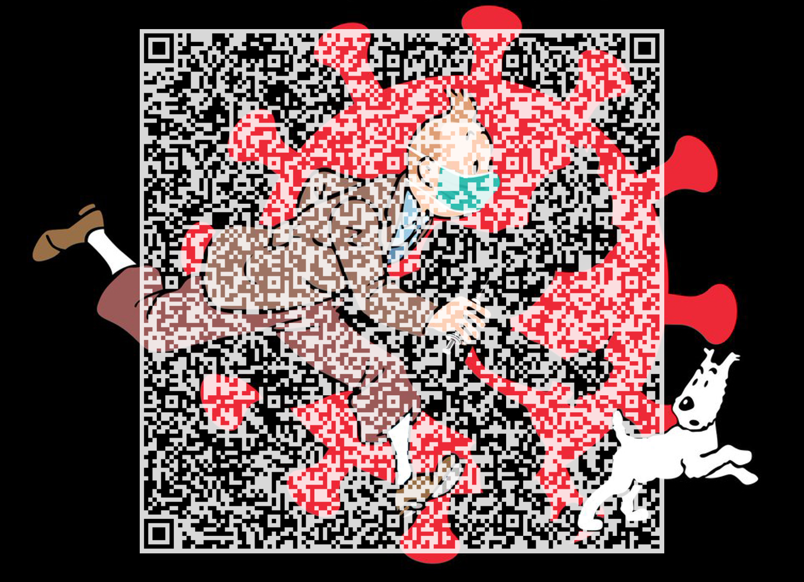
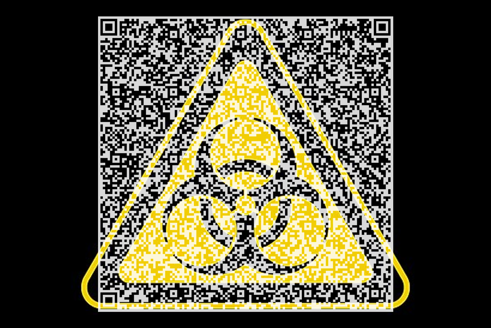
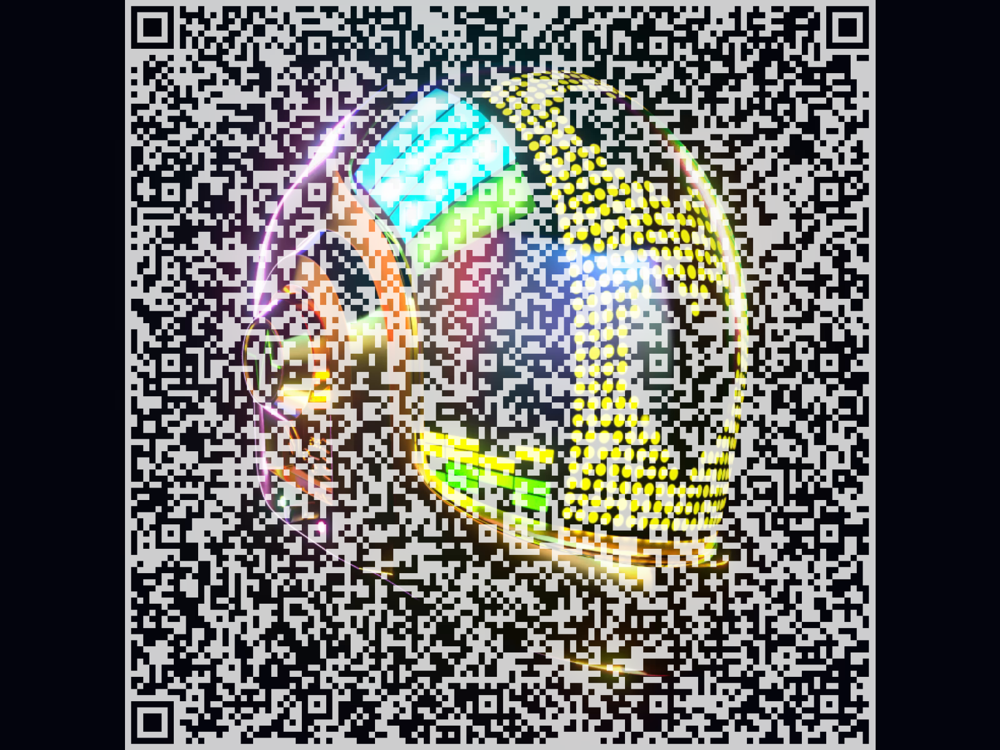
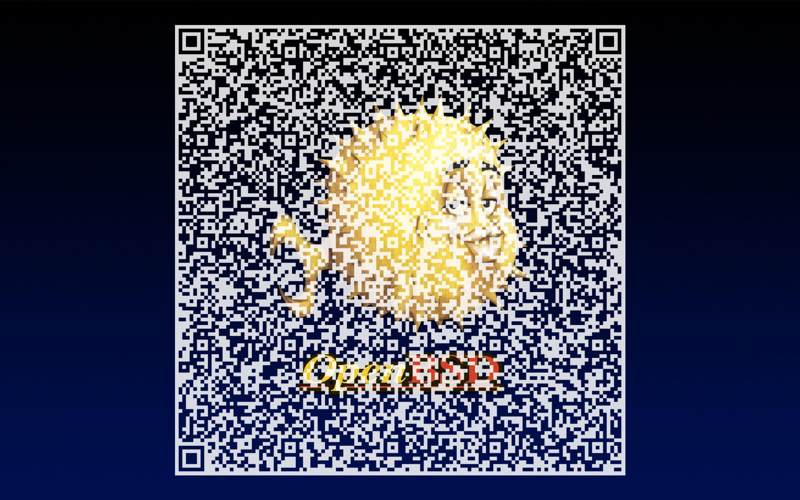

# Make Your Pass (Sanitaire) Fun Again
Customize your Pass Sanitaire (French name for EU digital Covide19 Certificate) with colors and images, thus make it **Fun** again.

## Usage

    usage: passfun.py [-h] [--scale [SCALE]] [--pos [POS]] [--trans [TRANS]] [--test [TEST]] inputfile backgroundfile outputfile

    Make your EU digital COVID certificate fun again.

    positional arguments:
      inputfile        The original qrcode
      backgroundfile   Background image, can start with 'http'
      outputfile       The new qrcode

    optional arguments:
      -h, --help       show this help message and exit
      --scale [SCALE]  Scale of the target qrcode in percent, default=100
      --pos [POS]      Generated qrcode horizontal position, 0=left, 100=right
      --trans [TRANS]  Background transparency, 0=white, 100=original image
      --test [TEST]    Download random test data from dgc-testdata instead of inputfile

## Example

Here's some examples generated by demo.py:

